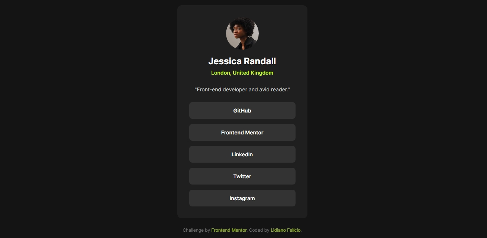

# Frontend Mentor - Social links profile

This project focuses on building a clean, accessible, and responsive user interface while following best practices in HTML and CSS.

## 📸Screenshot

This is a solution for the **Social Links Profile** challenge from Frontend Mentor. The goal of this project was to build this social links profile and make it as close as possible to the design.

---

## 📌 Overview

### 🧩 The Challenge

📋 Users should be able to

* View the optimal layout depending on their device's screen size
* See hover states for all interactive elements on the page
* See focus states when navigating using the keyboard
* Navigate through links using the keyboard (Tab and Enter)

---

## 🔗 Links
Solution URL: https://www.frontendmentor.io/profile/lidianofeliciobr
Live Site URL: https://lihsousa.github.io/Perfil_links_sociais/git add .

---

## 🛠️ Built with

* Semantic HTML5
* CSS
* Flexbox
* Mobile-first workflow

---

## 🎯 What I learned

In this project, I practiced:

Structuring semantic HTML elements
Using Flexbox for layout and alignment
Creating consistent spacing using gap and margin
Implementing hover and focus states for better accessibility
Improving UI details to match the design as closely as possible

Example of hover and focus styles:

.links a:hover,
.links a:focus {
  background-color: hsl(75, 94%, 57%);
  color: hsl(0, 0%, 8%);
}

--- 

## 🚀 Continued development

In future projects, I want to focus on:

Improving layout techniques with CSS Grid
Writing cleaner and more scalable CSS
Enhancing accessibility (ARIA, keyboard navigation)
Building more complex responsive layouts

---

## 👤 Author

Frontend Mentor - https://www.frontendmentor.io/profile/lidianofeliciobr
GitHub - https://github.com/lihsousa

---

## 🤖 AI Assistance

This project was developed with the support of AI tools (ChatGPT) to clarify concepts, improve code structure, and assist with best practices.

All implementation and final decisions were made by me as part of my learning process.

---

## 🙏 Acknowledgments

Thanks to Frontend Mentor for providing this challenge and helping developers improve their skills through real-world projects.
